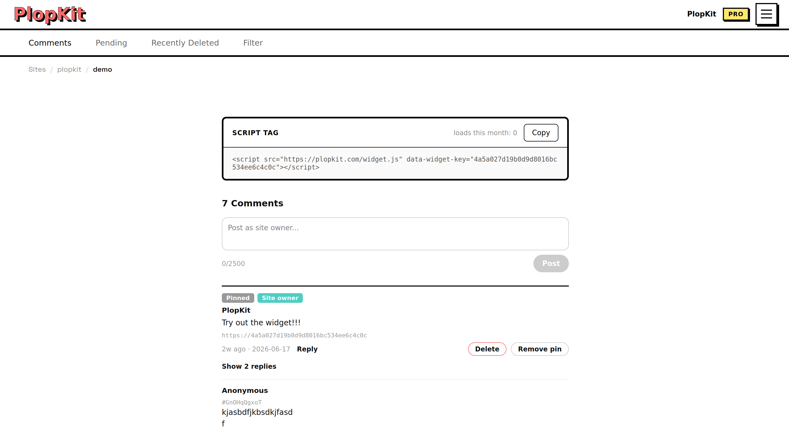

# PlopKit

PlopKit is an open-source, self-hostable comment platform. 
Create comment widgets in seconds, embed them anywhere with a
single script and manage everything from a clean web dashboard.

- 💬 Modern embedded comment widgets
- 🛡️ Built-in moderation tools such as:
   - Accepting or rejecting incoming comments
   - Auto accept comments
   - Ban certain words
   - And many more in the future
- 📦 Import and export website data for easy migration between selfhost and cloud 
- 🐳 Easy Docker deployment
- 🔓 Fully open source and self-hostable

Visit [plopkit.com](https://plopkit.com)!.


# Self hosting PlopKit
 
PlopKit is fully self-hostable. Self-hosted instances have no feature
restrictions compared to the hosted version at plopkit.com. Billing and
usage limits are the only things specific to the hosted service, and 
none of that code runs in self-hosted mode.
 
# Running locally

## Clone the repo
 
```bash
git clone https://github.com/runn077/plopkit
```
## Setup
- [docker compose](selfhost/README.md) 
- [dockerized db only](CONTRIBUTING.md##Setup-with-dockerized-db)

## Questions or ideas?
Open a [Discussion](https://github.com/runn077/plopkit/discussions) it's the best place to ask questions, share ideas, or get help.

## Found a bug?
Feel free to open an [issue](https://github.com/runn077/plopkit/issues) if you find anything.
